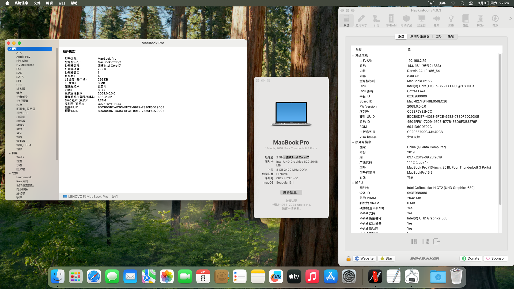

# Lenovo-81BS-i7-8550U-Hackintosh
应用于联想小新2018款潮7000-13 i7版(81BS)的OpenCore 1.0.3的黑苹果引导 支持macOS Sequoia 15.1

注意：此EFI不含三码 实际使用时请自行使用[OCAT](https://github.com/ic005k/OCAuxiliaryTools)生成


### 配置清单
|类型|型号|规格|
|---|---|---|
|CPU|Intel i7-8550U|3.9 GHz|
|内存|三星 4GB DDR4×2(板载)|2400 MHz|
|SSD|三星 MZVLW256HEHP-000L2 NVMe|256 GB|
|显卡 1|Intel UHD 620|2048 MB|
|显卡 2|NVIDIA GeForce MX150|2048 MB|
|声卡|Conexant CX20751/2|立体声|
|Wi-Fi|Intel AC 3165 m.2版|433 Mbps|
|操作系统|macOS Sonoma - Sequoia|14.4 - 15.1|
|BIOS|InsydeH20 UEFI|5ZCN39WW(2019/6/24)|

##### 附注事项
- 关闭CFG Lock可在Grub Shell输入这个指令：
```
setup_var 0x3C 0x00
```
- 经测试，上文给出的三星硬盘会导致macOS出现卡顿问题，在实际使用时建议优先更换为可完美兼容macOS的NVMe固态硬盘，并移除/禁用"NVMeFix.kext"驱动程序。
- 睡眠与唤醒未测试，如果出现睡死情况，可使用终端强制关闭睡眠功能：
```
sudo pmset -a sleep 0
sudo pmset -a hibernatemode 0
sudo pmset -a disablesleep 1
```

### 不可工作的部分
- 空投与接力：需要破解BIOS白名单，并更换可兼容的博通Wi-Fi网卡
- microSD读卡器：暂时无解
- iPhone镜像：无解
- 独立显卡：无解
- HDMI接口：未测试

